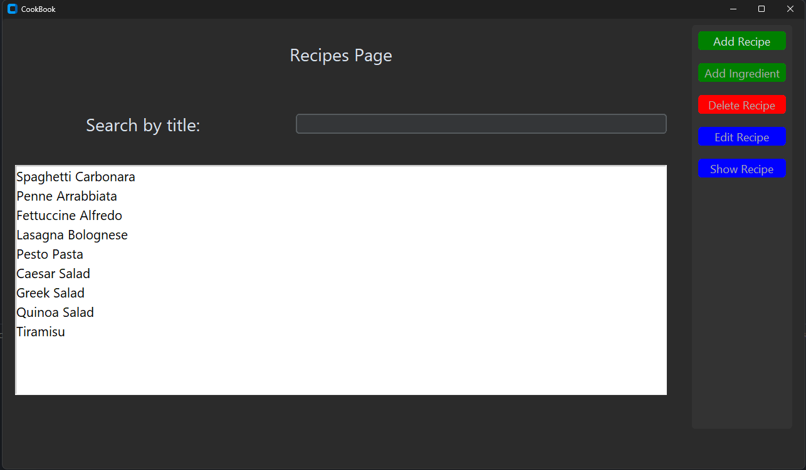
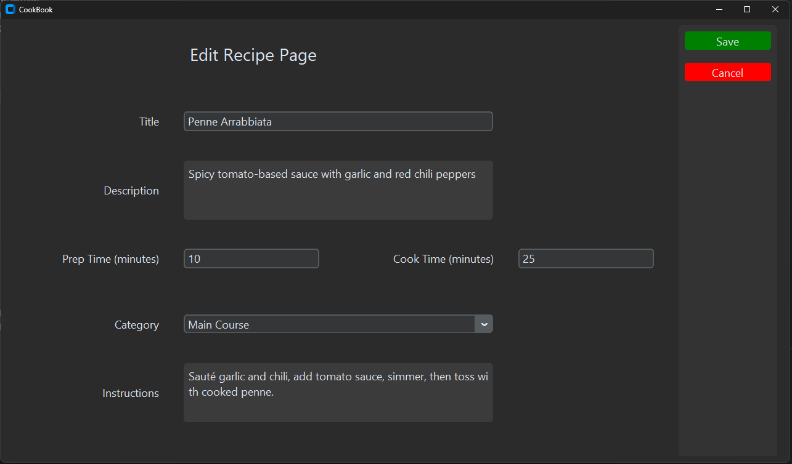

# CookBook

## Description
This is a simple recipe manager app. You can add your custom recipes along with their ingredients and then you can generate a PDF file containing all the ingredients, so you can easily keep track of you recipes and their preparation process.

## TODO List
- [ ] Upgrade to a more modern GUI (PyQT)
- [ ] Add custom food categories
- [ ] Add choosing recipes by category
- [ ] Add searching by ingredients

## Table of Contents
- [Prerequisites](#prerequisites)
- [Installation](#installation)
- [Usage](#usage)
- [Contributing](#contributing)
- [License](#license)

## Prerequisites
Before running the CookBook application, ensure you have the following libraries installed, especially tkinter and custom tkinter **MySQL Connector is NOT REQUIRED**, the app uses sqlite3:

- **Tkinter**: A standard GUI library for Python.
- **customtkinter**: A library to create modern and customizable GUIs based on Tkinter.
- **MySQL Connector/Python (mysql-connector-python)**: A library to connect your application to a MySQL database.

### OPTIONAL: Install MySQL on Your PC
1. **Download MySQL Community Server**:

    - Visit the MySQL official website and navigate to the downloads section for the MySQL Community Server.
    - Choose the version that is compatible with your operating system and download it.

2. **Install MySQL**:

    - Execute the downloaded installer.
    - Follow the prompts in the installation wizard. Choose a setup type like "Full", "Custom", or "Server Only". "Full" or "Server Only" is recommended for most users.
    - During the installation, set up the root password and create user accounts if necessary.
    - Configure the MySQL Server, such as setting the port (default is 3306) and deciding whether it should run as a Windows service.

3. **Verify MySQL Installation**:

    - Open a command prompt or terminal.
    - Type mysql -u root -p and press Enter.
    - Enter the root password when prompted. If you access the MySQL shell successfully, the installation is confirmed.

### Download necessary libraries
To install these libraries, use the following commands:

1. Tkinter (usually comes pre-installed with Python, but in case it's not):
   ```
   pip install tkinter
   ```

2. Customtkinter:
    ```
    pip install customtkinter
    ```

3. OPTIONAL: MySQL connector for Python:
    ```
    pip install mysql-connector-python
    ```

Ensure these installations are successful before proceeding to the installation of the CookBook application.

## Installation
### To download the repository, follow these steps:

1. Clone this repository to your local machine
   ```
   git clone https://github.com/S1lence-z/cook-book.git
   ```

2. Go to the downloaded directory in the folder from which you start the command above

### How to start the program:

**Without MySQL Connector:**

1. Open the cloned directory in your favorite IDE

2. Navigate to the cloned directory in your command line and run the following command:
    ```
    python main.py
    ```


**With MySQL Connector:**

1. Open the cloned directory in your favorite IDE

2. Open the db folder and create the database and two tables as in the file: CookBookDB.session.sql. You can also populate it with the testing data

3. Create a file called db_login.py in the db folder and create the following constants:

    

4. Navigate to the cloned directory in your command line and run the following command:
    ```
    python main.py
    ```

## Usage
### Recipes page:
This page shows a list of all the recipes. You can view, edit, or delete a recipe from this page.



### Edit recipe page:
This page allows you to edit the details of a specific recipe. You can modify the recipe name, ingredients, and instructions.



### Recipe detail page:
This page displays the detailed information of a specific recipe. It includes the recipe name, ingredients, instructions, and an image of the dish.


### Ingredients page:
This page lists all the ingredients used in the recipes. You can add, edit, or delete ingredients from this page.


### Generate PDF window:
This window allows you to generate a PDF file containing all the ingredients of your recipes. It helps you keep track of the ingredients needed for your recipes.


## Contributing
Explain how others can contribute to your project. Include guidelines for submitting pull requests or reporting issues.

## License
This project is licensed under the [MIT License](https://opensource.org/licenses/MIT).

## Contact
If you have any questions or suggestions please contact me on this email address:
j3.zelenka@gmail.com

## Additional Documents
[Used Python Naming Conventions](./docs/python_naming_conventions.md)
